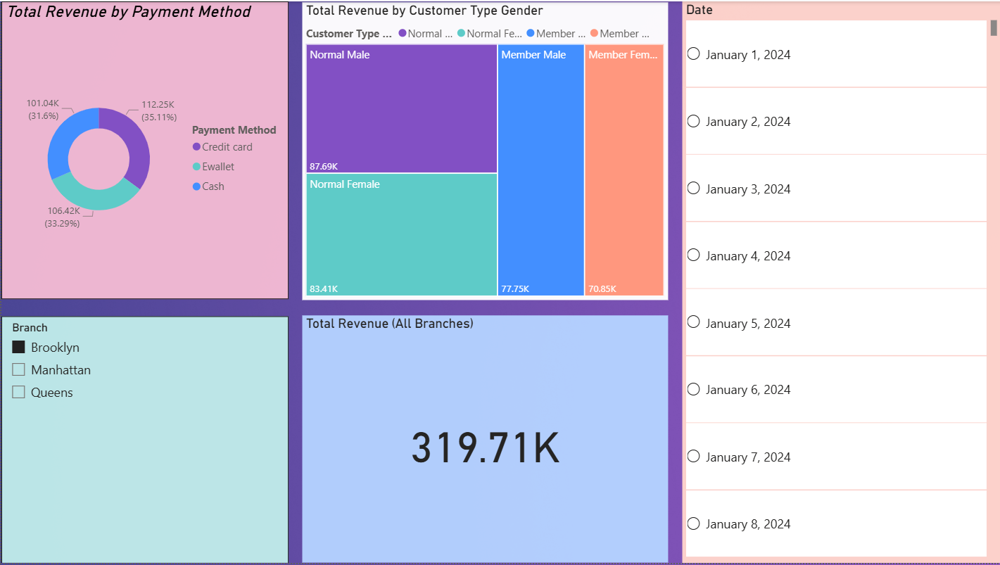
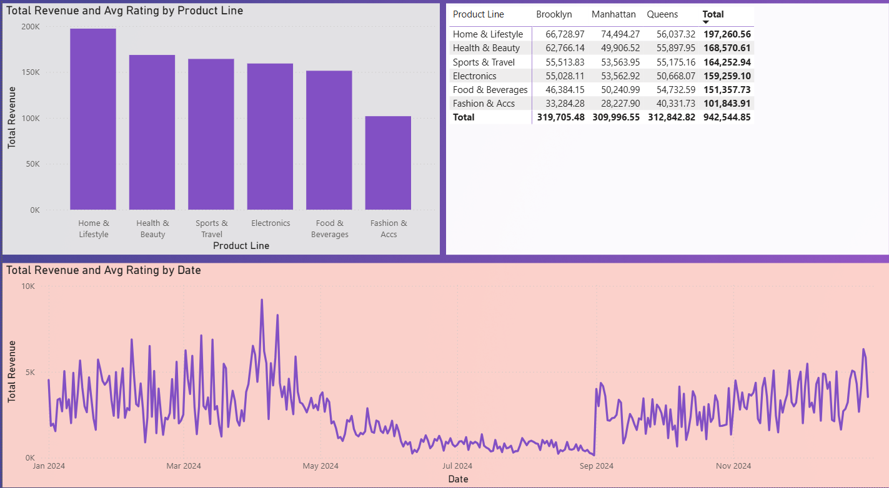
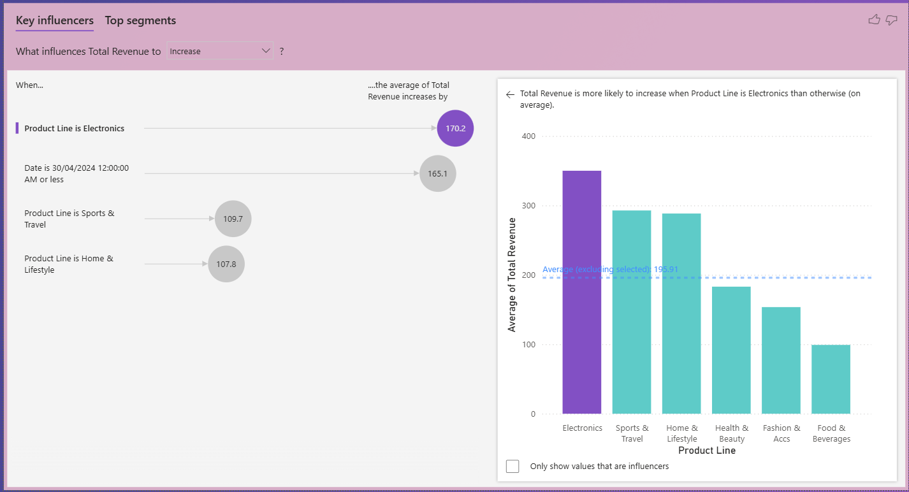
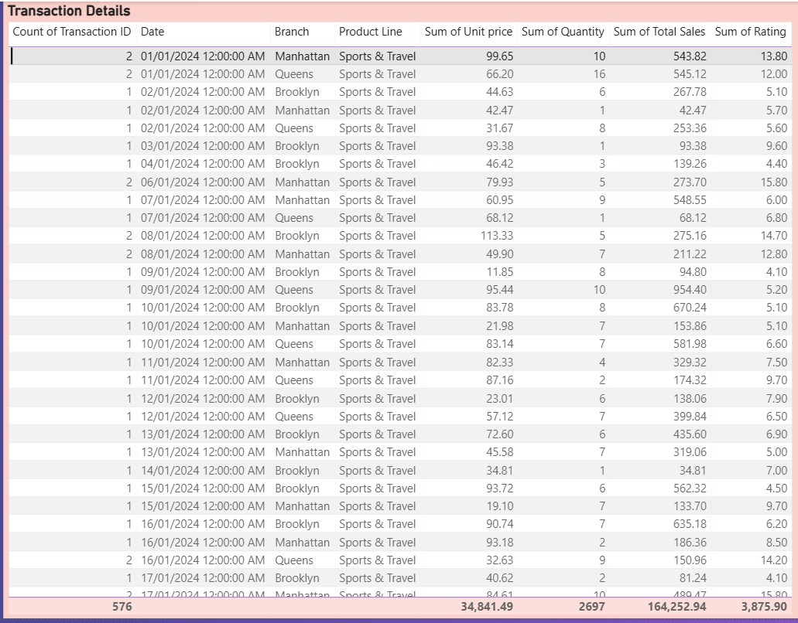

# Supermarket Sales Analysis – Power BI Project

This project analyzes supermarket sales data for three branches (Queens, Brooklyn, and Manhattan) in New York City for the year 2024. The goal of this project is to transform raw sales data into meaningful business insights using Power BI.

## 📌 Project Overview

The dataset contains **5050+ sales** transactions with details such as:
- Date
- Branch
- Customer Type 
- Gender
- Product Line
- Unit Price
- Quantity
- Payment Method
- Rating

Using this data, I built a complete Power BI report with a star schema model to analyze sales performance, customer behavior, and product trends.

## Project Goals
- Identify which branch generated the highest revenue
- Find the top-performing product lines
- Analyze customer purchasing behavior
- Compare payment method usage
- Study monthly and seasonal sales trends
- Explore customer ratings and satisfaction

## Data Modeling

I designed a Star Schema model in Power BI:
- **Fact Table:** Fact_Sales
- **Dimension Tables:**
  - Dim_Branch
  - Dim_Product
  - Dim_Customer
  - Dim_Payment
  - Dim_Date

Key Measures Created:

**Total Revenue**
- Revenue by Product Line
- Revenue by Branch
- Monthly Sales Trend

## Tools Used
- Power BI
- Data Modeling (Star Schema)
- DAX Calculations
- Data Visualization
- Kaggle Dataset

# Dashboard Preview in Power BI

1. Executive Overview  

2. Product & Sales Analysis  

3. Customer & Payment Analysis  

4. Transaction Details  

### Dataset Source

Dataset: [Supermarket Sales](https://www.kaggle.com/datasets/hanif13/supermarket-sales)   
Source: Kaggle
